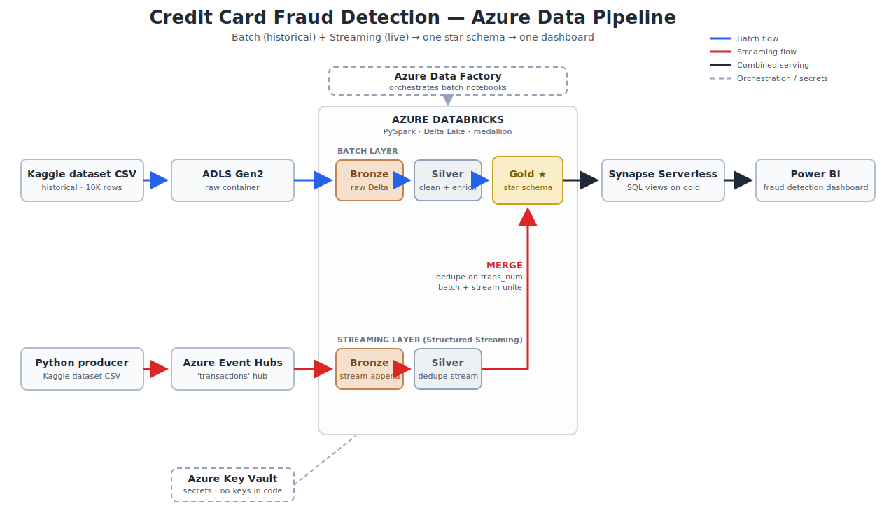
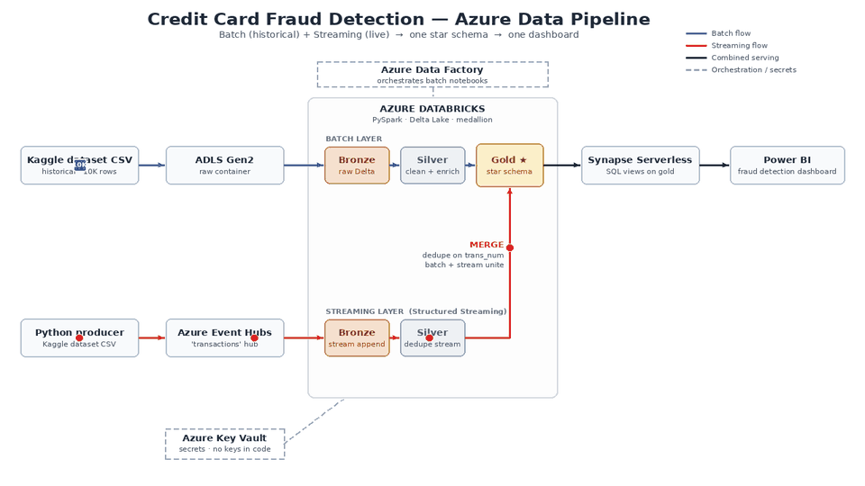
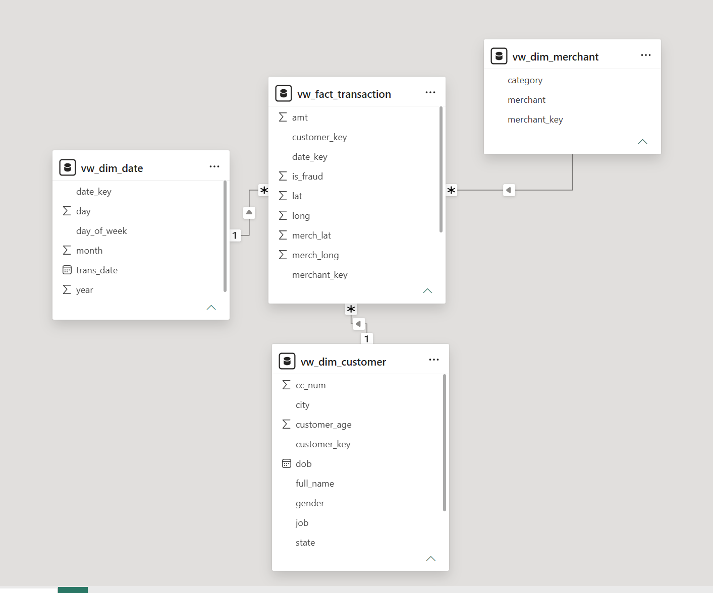
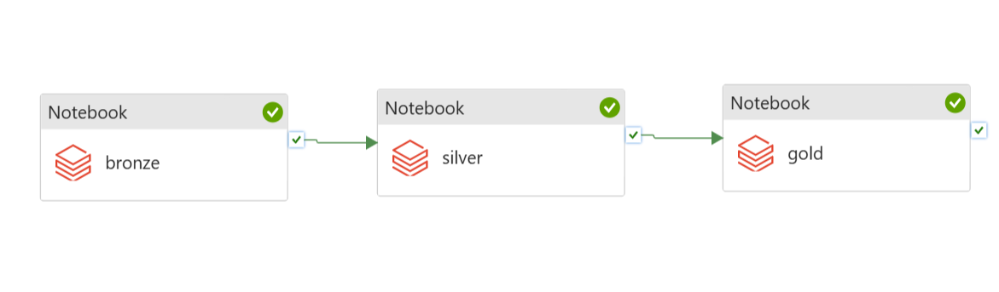
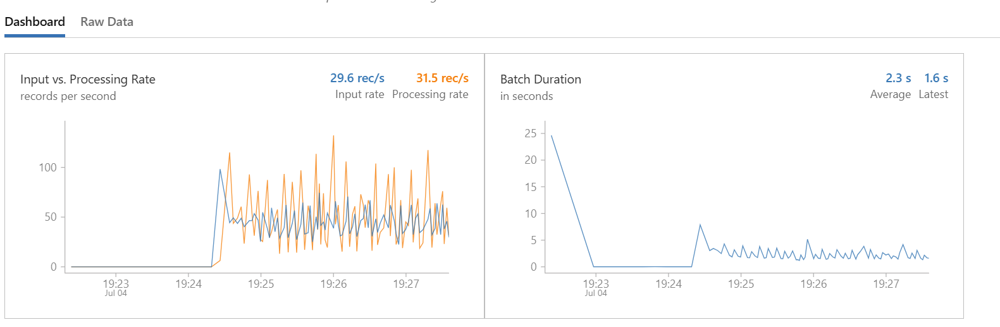

# Credit Card Fraud Detection Pipeline on Azure (Batch + Streaming)

I built this project to learn Azure data engineering hands-on. It moves credit card
transactions through two paths — a **batch load** of historical data and a **live stream**
of new events — cleans them, shapes them into a star schema, and shows everything in a
Power BI dashboard.

> ✅ **Status:** Complete — batch, streaming, and reporting all working

---

## Architecture



How the data actually moves — batch travels as one big chunk (blue), streaming as a
steady trickle of events (red), and both end up in the same gold star schema:



---

## Tech stack

| Service | What it does here |
|---|---|
| **ADLS Gen2** | The data lake — three containers: `raw`, `processed`, `curated` |
| **Azure Databricks (PySpark)** | Runs all the transformation code, batch and streaming |
| **Azure Event Hubs** | The front door for live events |
| **Azure Data Factory** | Runs the batch notebooks in order, on one click |
| **Synapse Serverless SQL** | Lets Power BI query the lake with plain SQL, pay-per-query |
| **Power BI** | The fraud detection dashboard |
| **Azure Key Vault** | Holds all secrets — no keys or passwords in code |
| **Delta Lake** | The table format everywhere — supports streaming and MERGE |

---

## Dataset

Synthetic credit card transactions from the Sparkov fraud dataset on Kaggle, cut down to
10,000 rows per file to keep costs near zero while learning. The two files cover different
time periods, so they naturally act like a real system: the earlier file is the history
(batch), the later file plays the role of new live transactions (streaming).

---

## 1. Batch pipeline

**Flow:** Kaggle CSV → ADLS `raw` → Databricks bronze → silver → gold → Synapse → Power BI

| Layer | What happens |
|---|---|
| **Bronze** | The raw CSV lands as-is in Delta format — an untouched copy for auditing |
| **Silver** | Data gets cleaned: correct types, duplicates removed, useful columns added (customer age, transaction hour) |
| **Gold** | The star schema is built — `FactTransaction` plus `DimCustomer`, `DimMerchant`, `DimDate` |

The storage key is pulled from Key Vault at runtime through a Databricks secret scope,
so the notebooks never contain a credential.

📸 *Star schema in Power BI model view:*



---

## 2. Orchestration — Azure Data Factory

ADF chains the three batch notebooks together with on-success arrows, so one run executes
the whole bronze → silver → gold sequence on the Databricks cluster.

📸 *Pipeline after a successful run (three green activities):*



ADF costs nothing while idle — it only bills per run, and no schedule trigger is left on.

---

## 3. Streaming pipeline

**Flow:** Python producer → Event Hubs → Structured Streaming → streaming bronze/silver

- A small **Python script** on my laptop reads the second Kaggle file in time order and
  sends each row as a JSON event to Event Hubs — simulating live transactions.
- A **Structured Streaming** notebook picks up the events, parses the JSON, and appends
  them to a streaming bronze Delta table. A **checkpoint** remembers exactly what has been
  processed, so the stream can stop and resume without losing or duplicating anything.
- A second stream reads that bronze table and applies the silver cleaning continuously,
  including removing duplicate transactions.

📸 *Producer sending events while the Delta row count climbs live:*



---

## 4. Where the two paths meet — the MERGE

The streamed data is merged into the same gold fact table the batch path built, matched
on the transaction ID (`trans_num`). New transactions get inserted; anything already in
the table is skipped. That means the merge can run any number of times — even replayed
events can't create duplicates or double-count fraud.

Batch brings the history, streaming brings what's new, and the MERGE joins them into one
star schema. That's the whole point of calling it a *hybrid* pipeline instead of two
separate ones.

---

## 5. Serving — Synapse Serverless SQL

Simple SQL views sit on top of the gold Delta folders. Synapse reads the storage using
its own managed identity (given Storage Blob Data Reader on the lake), so even Power BI
connecting with a plain SQL login can query the views without any storage keys.

I chose serverless on purpose: it costs a fraction of a cent per query at this size,
while the smallest dedicated SQL pool would cost around $870/month just sitting idle.

---

## 6. Reporting — Power BI

The dashboard imports the four Synapse views and links fact → dimensions on the key
columns. The design uses only two colors on purpose: quiet gray for everything normal,
and **red only for fraud** — so anywhere you see red, it means the same thing.

📸 *Final dashboard:*


---

## Problems I hit and what I learned

- **Key Vault 403 in Databricks** — the AzureDatabricks service principal needed Get/List
  permissions on secrets; switching the vault to Access Policy mode fixed it.
- **Delta rejected my column names** — the CSV had a leftover `Unnamed: 0` index column
  with a space in it; dropped it and added a name sanitizer before writing bronze.
- **A hidden NAT gateway was charging ~$1/day** even with the cluster off — it lives in
  the Databricks managed resource group. Recreating the workspace with the "No Public IP"
  option removed it completely.
- **Maven install blocked** — Unity Catalog blocks libraries on shared clusters; switching
  the cluster to Dedicated (single user) mode let the Event Hubs connector install.
- **Streaming basics that clicked** — checkpoints resume exactly where you stopped;
  dedupe in a stream keeps growing state (fine at 10K rows, watermarking is the real fix);
  and a Delta table can be both the output of one stream and the input of another.
- **MERGE over append** — matching on the transaction ID makes loading safe to re-run,
  which saved me the day I almost replayed the producer twice.

---

## Cost

The whole build cost a few dollars, almost all of it Databricks cluster hours. The tricks
that kept it that low: serverless SQL instead of a dedicated pool, a single-node cluster
that auto-terminates after 15 minutes, creating Event Hubs last and deleting it first
(it bills ~$0.03/hour just for existing), and replaying events fast instead of in real
time. Data size was never the cost driver — leaving things running is.

---

## Repository structure

```
azure-fraud-detection-pipeline/
│
├── README.md
│
├── architecture/
│   ├── architecture_diagram.svg      # static diagram (also .png)
│   └── data_flow.gif                 # animated batch + streaming flow
│
├── scripts/
│   └── event_hub_producer.py         # replays CSV rows as JSON events
│
├── databricks/
│   ├── batch/
│   │   ├── 01_bronze_ingest.py
│   │   ├── 02_silver_clean.py
│   │   └── 03_gold_star_schema.py
│   ├── streaming/
│   │   ├── 04_stream_consumer.py     # Event Hubs → bronze/silver streams
│   │   └── 05_stream_to_gold.py      # MERGE streamed data into the fact table
│   └── screenshots/
│       └── live_counts.png
│
├── adf/
│   └── screenshots/
│       └── adf_pipeline_run.png
│
├── synapse/
│   └── create_views.sql              # database, credential, and views setup
│
└── powerbi/
    └── screenshots/
        ├── dashboard_overview.png
        └── model_view.png
```

---

## Known limitations and future work

- Streamed transactions from customers or merchants not seen in the batch data get null
  dimension keys — inserting new dimension rows before the fact MERGE would fix this.
- Streaming dedupe should use watermarking so its memory use stays bounded.
- `Trigger.AvailableNow` could replace the always-on stream for scheduled micro-batches.
- A real-time dashboard (DirectQuery or streaming datasets) on top of the silver stream.

---

## How to reproduce (short version)

1. **Set up the basics** — resource group, ADLS Gen2 (hierarchical namespace on, with
   `raw`/`processed`/`curated` containers), and a Key Vault in Access Policy mode holding
   the storage key (grant AzureDatabricks Get/List on secrets).
2. **Batch** — create a Databricks workspace ("No Public IP" = No, to avoid the NAT
   gateway charge) with a single-node auto-terminating cluster, link it to Key Vault via a
   secret scope, upload the sampled Kaggle CSV to `raw`, and run notebooks 01 → 02 → 03.
   Chain them in ADF for one-click runs.
3. **Serve and report** — run `synapse/create_views.sql` on the built-in serverless pool
   (give the Synapse managed identity Storage Blob Data Reader first), then connect
   Power BI to the serverless endpoint and build the dashboard.
4. **Stream** — create an Event Hubs namespace (Basic) with a `transactions` hub, put its
   connection string in Key Vault, install the Event Hubs Spark connector on the cluster,
   start notebook 04, and run the producer script. Then run notebook 05 to merge the
   streamed data into the fact table.
5. **Tear down** — stop the streams, terminate the cluster, and delete the Event Hubs
   namespace the same day. Deleting the resource group removes everything at once.
